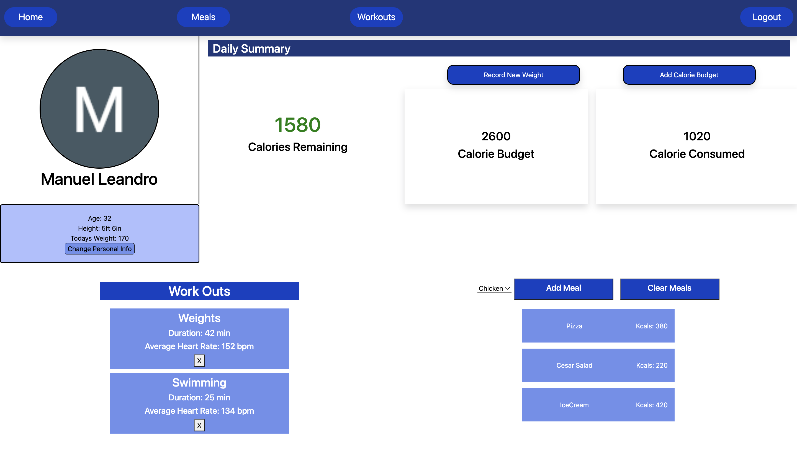

# Health Tracker

[Live Site](https://health-tracker.fly.dev "Health - Tracker Link")
---------------------

This health tracking app is meant to be a personal journal that you can take with you anywhere. Being aware of what you eat and how much activity you are doing on a daily basis really motivates you to be a little healthier. Writing things down is the first step to take to manifesting all of your goals.

## Technologies Used
* Express
* JavaScript
* Mongoose
* MongoDB
* Node
* EJS
* CSS
* Fly.io (*deployment*)

## IceBox

- [ ] Refactor Styling
- [ ] Change Style for Calories Remaining if Below 0
- [ ] Fix flex styling

[Planning Materials](https://trello.com/b/sgLHcO7W/unit-2-project-health-tracker "Planning Materials link")